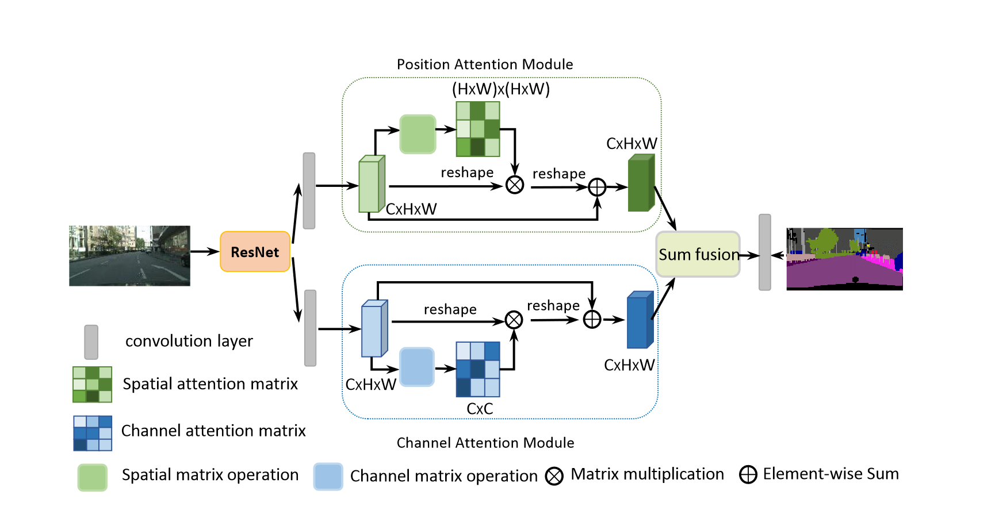
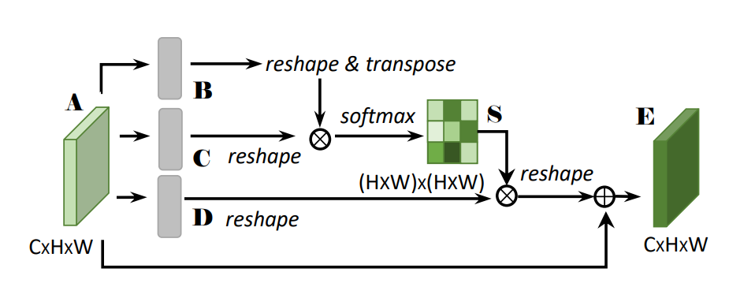
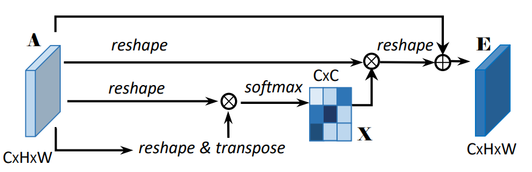
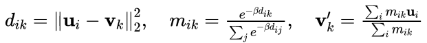
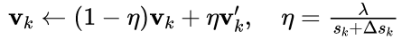
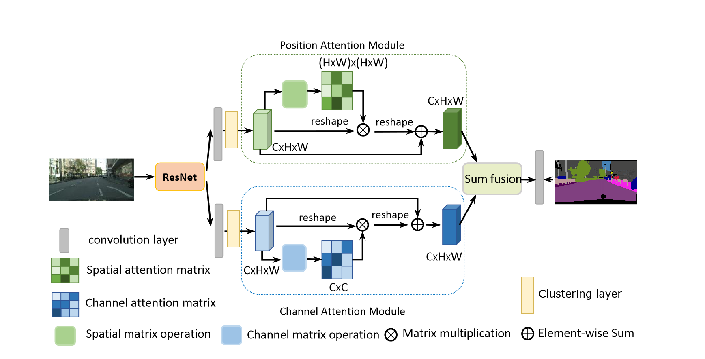
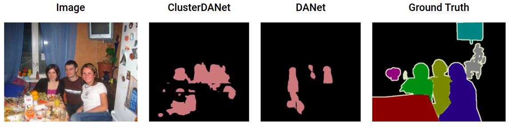
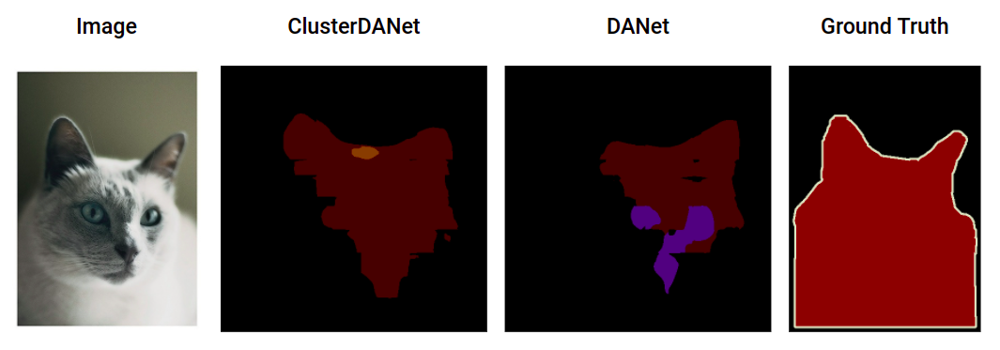
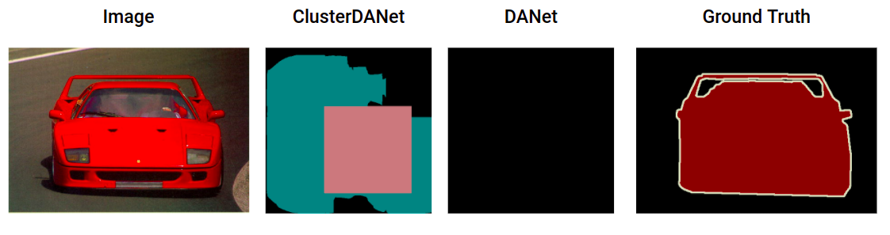

* Marnix Enting (4659147) - <m.f.g.enting@student.tudelft.nl>
* Tishar Sinha (5277876) - <T.Sinha-2@student.tudelft.nl>
* Dajt Mullaj (5649455) - <d.mullaj@student.tudelft.nl>

The link to the original paper can be found <a href="https://arxiv.org/pdf/1809.02983.pdf" title="Link to the paper" >here</a>.

## Introduction
In this blog, Duel Attention Network (DANet) will be explained, and a proposal for an architecture improvement will be given and evaluated. In 2019, Fu et al. published an article that introduces the DANet. The architecture is used for scene segmentation. This is a fundamental and challenging problem which involves segmenting different image regions with semantic categoris including things (e.g. building, grass, sky) and discrete objects (e.g. pedestrian, car, bicycle). The study can applied to applications in automatic driving, robot sensing and image editing. In order to effectively solve the task of scene segmentation. A distinction needs to be made effectively distinguish between objects of similar appearance. For instance, regions of 'road' and 'concrete' can be indistinguishable. Likewise, the objects of 'cars' may often be affected by scales, occlusion and illumination. Therefore, it is required to enhance the discriminative ability of feature representations at the pixel-level as well as  global level. This is precisely what the DANet aims to accomplish. Namely, they introduced an architecture with both a position and a channel attention module, to capture both local and global information.

## Network architecture
 
<!-- 

 -->
Dual Attention Network has two types of attention modules to adaptively aggregate long range contextual information to improve feature representation for pixel-level prediction in scene segmentation.  Initially it employs a pretrained residual network with the dilated as the backbone. Then the features from the dilated residual network would be fed into two parallel attention modules named position attention module and channel attention module. The position attention module selectively aggregates the feature at each position by a weighted sum of the features at all positions. So that, similar features would be related to each other regardless of their distances. On the other hand, the channel attention module selectively emphasizes interdependent channel maps by integrating associated features among all channel maps.
 
<!-- 

 -->
It first applies a convolution layer to get the features of dimension reduction and then feed it to the positional attention module. In positional attention module it first generates a spatial attention matrix which models the spatial relationship between any two pixels of the features. Next, it performs a matrix multiplication between the attention matrix and the original features. Lastly, it performs an element-wise sum operation on the above multiplied resulting matrix and original features to obtain the final representations reflecting long range contexts.
 
<!-- 

 -->
In channel attention module the process is like position attention module except for the first step, in which channel attention matrix is calculated in channel dimension. In the end it collects the output from both attention module.

## Architecture addition
To increase the performance of the architecture we wanted to add clustering layers before the 
self-attention layers. This idea was based on a paper by <a href="https://openreview.net/pdf?id=vujTf_I8Kmc" title="Link to the paper clustering" >Weijian Xu et al (2021)</a>. Here they implement cell feature clustering. Where cell features are defined as individual local feature at a position in the feature map. By clustering these cell features they are able to model the underlying distribution of input cell features. Through this method, the authors were able to bring 2.5-6.4% performance increase over baseline models. 

The method employed by the authors and for this project works by clustering individual features at each location in the feature map (i.e. cell features) into multiple centres and employing the cluster centres as filters. This is done using a mini-batch soft k-means algorithm to cluster the cell features approximately. We report here the steps they proposed in their algorithm as they were layed out in their paper:

-	**Initialization.** Randomly initialize global cluster centers \\(V = \{v_1, v_2, ..., v_K\}\\) and a counter $s = (s_1, s_2, ..., s_K) = \textbf{0}$.

-	**Cluster assignment.** In the forward step, given input cell features $U = \{u_1, u_2, ..., u_n\}$, we compute the distance vector $d_i = (d_{i1}, d_{i2}, ...d_{iK})$ between input cell feature $u_i$ and all cluster centers $V$. We can then compute the soft assignment $m_{i k} \in \mathbb{R}$ using the softmax function. This will be used to generate the mini-batch centers $v'_k$:

 
<!-- 

 -->

- **Centroid Movement.** In the equation below we formalate $\Delta \mathbf{s} = \sum_{i} m_{i}$ by summing all maps 
$m_{i}= ( m_{i1}, m_{i2}, ... m_{iK} )$. The mini-batch centers $v^{'}_k$ are then updated to the global center 
$v_k$ with a momentum coefficient $\eta$.

 
<!-- 

 -->

- **Counter Update.** Lastly a counter update $\mathbf{s}$ is updated and the distance vectors $\mathbf{d_i}$ are reshaped and returned.

$$\mathbf{s} \leftarrow \mathbf{s} + \Delta \mathbf{s}$$

The above clustering algorthim is used for both attention layers in the DANet architecture. Which results in the following new architecture:

<!-- 

 -->

## Dataset
The dataset used was PASCAL Visual Object Classes (VOC) dataset.  The PASCAL Visual Object Classes (VOC) 2012 dataset contains 20 object categories including vehicles, household, animals, and some others. Every image in this dataset has pixel-level segmentation annotations, bounding box annotations, and object class annotations. This dataset has been widely used as a benchmark for object detection, semantic segmentation, and classification tasks. The PASCAL VOC dataset is split into three subsets: 1,464 images for training, 1,449 images for validation and a private testing set. The Dual Attention Network for Scene Segmentation model on which our model is based on uses Cityscapes, PASCAL VOC 2012, PASCAL Context, COCO Stuff datasets.

## Experiment Setup and Results
We trained DANet for PASCAL VOC 2012 using the following hyperparameters:
- epochs: 22
- batches: 6
- learning rate: 0.003
- base size: 520
- crop size: 480

Due to the limitations of the GPU that was available to us we had to limit ourselves to these more conservative parameters. Therefore we were not able to reproduce the results the author of DANet put forward in their paper. We could however obtain a baseline model against which we could compare our extended model against. 

After training DANet we therefore trained our extended version (ClusterDANet) utilizing the same hyperparameters. We trained the models using Google Colab, on a single GPU. Normal DANet took approximately 25 minutes per epoch, while ClusterDANet completed every epoch in 38 minutes. The training loss of the two models followed similar patterns. 

Both models results are not very clear compare to the ground truth labels. We can however compare them against each other. The following images were obtained from the validation set of PASCAL VOC 2012.

 
<!-- 

 -->

 
<!-- 

 -->

As is shown in the pictures, typically, ClusterDANet tends to pick up more details when creating a segmentation mask for an object. This supports our intuition that using clustering we can relate bigger components of a picture to each other, rather than each individual pixel. Indeed it seems more intuitive to first differentiate between different features of an image (an object part, a hand, a wheel...) and then try to distinguish meaningful relationships between these features using attention (therefore a hand with a head, a wheel with a car...). By adding a clustering layer we try to explicitly model these features, rather than relying only on the implicitly learned ones by the convolutional layers. 

Sometimes, however, the limitations of a linear clustering model as K-Means become apparent, as in the next picture.

 
<!-- 

 -->

Indeed while it is possible to argue that ClusterDANet does at least see the car, compared to normal DANet, its segmentation accuracy nullifies the advantage. We can see how a clear square is cut out in the generated segmentation map. This is probably due the linear nature of the decision boundaries imposed by K-Means.

_Here we report the final results (still running accuracy on test set, however seems ClusterDANet is better)_

## Conclusion
We proposed an architecture extension to the work of Fu et al. based on the model presented by Weijian Xu et a. Our extension is a the addition of a clustering layer before the attention modules of the original network, in order to explicitly model the features present in a given image. We did so by following the intuition that by clustering together parts of an image, the attention layer would be able to better identify meaningful relationships between the objects of a picture and therefore the final architecture would provide better segmentation results. 

Due to low GPU resources we were only able to test our intuition on a limited budget. The results we obtained for our extension and for the baseline original architecture are therefore short compared to the state of the art. However they do offer insights on the comparison between the two models, and given the fact that normal DANet currently provides state of the arts comparable results for segmentation, comparing our model to DANet also offer insights on how it would perform given the right resources. 

ClusterDANet obtains better results than DANet for scene segmentation over the PASCAL VOC 2012 dataset (_if turns out to not be true they would be at least comparable_). Therefore our proposed extension has potential for achieving results comparable to the state of the art. Furthermore it seems that ClusterDANet sees bigger objects at a greater extent than DANet.

Future work could build upon our extension in order to tune the required hyperparameters (as number of clusters or epochs), in order to obtain the best possible results ClusterDANet could offer. Furthermore the clustering layer could be extend with a clustering algorithm different from K-Means, where the resulting decision boundaries are non linear.

